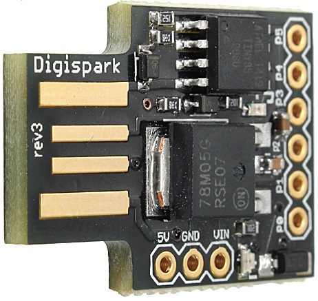

# Mouse Jiggler (with Digispark ATTiny85)
Simple mouse jiggler created using a Digispark ATTiny85:  
  
By default, simply moves the mouse 1 pixel, in sequence, "up", "down", "left" and "right".

## Notes for my Arch installation
1. Open Arduino IDE: go to **File** -> **Preferences** -> set "**Additional Boards Manager URLs**" to "http://digistump.com/package_digistump_index.json"
2. Go to **Tools** ->**Board** -> **Boards Manager...** -> search and install "**Digistump AVR Boards**"
3. Download latest Micronucleus release for your OS from "https://github.com/micronucleus/micronucleus/releases"
4. Put downloaded executable files (replace if existing) in your Micronucleus directory (in my case **$HOME/.arduino15/packages/digistump/tools/micronucleus/2.0a4**)
5. Add _udev rules_ for your user:

```
echo "SUBSYSTEM==\"usb\", MODE=\"0660\", GROUP=\"$(id -gn)\"" | sudo tee /etc/udev/rules.d/00-usb-permissions.rules
sudo udevadm control --reload-rules
```